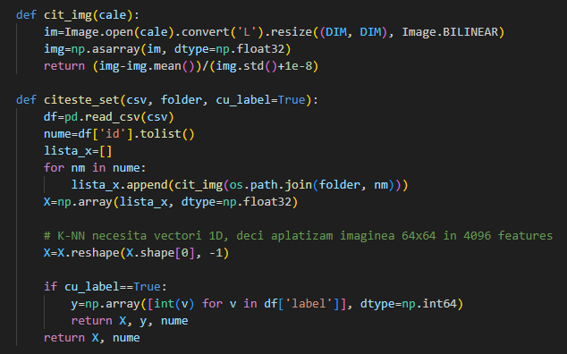
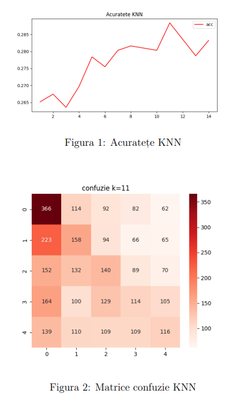
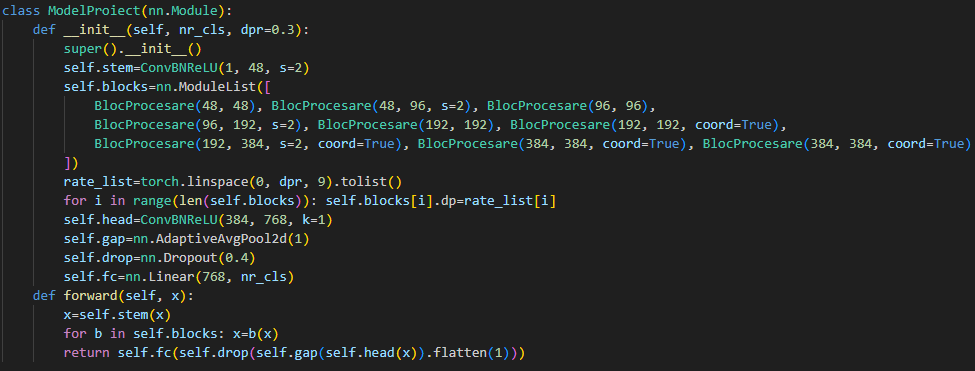
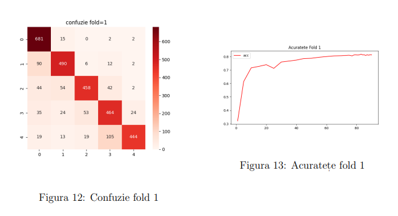

# Signal Object Detection - Machine Learning Project

🏆 **Final Result:** 3rd Place out of 146 participants (Accuracy: 0.813)

* **Date**: June 2026
* **Platform**: Kaggle
* **Institution**: Faculty of Mathematics and Computer Science, University of Bucharest

## Project Description
Participants are asked to employ machine learning methods to detect (count) objects in noisy radio signals, where classes represent the number of objects. In this context, a question that arises is whether this task should be treated as a classification or regression task.

## Model 1: K-Nearest Neighbors (K-NN)
The K-NN model was implemented as an initial solution to associate spectrograms through majority voting by finding the most similar signals in the training set.

* **Feature Extraction**: Each image was converted to the HSV color space, calculating a 3D histogram with 8 bins per channel (8x8x8).
* **Representation**: A 512-element vector was obtained for each spectrogram.
* **Distance Metric**: The Manhattan L1 distance was used, showing greater stability compared to the Euclidean L2 distance.
* **Optimization**: The K parameter was tuned within the [1, 14] range on an 80/20 data split.
* **Result**: The model has high execution speed but poor performance on complex signals. The confusion matrix demonstrated that a 512-element vector is insufficient to differentiate classes with similar colors, making the algorithm highly sensitive to noise.

## Model 2: Custom CNN Architecture
The primary solution consists of a CNN developed in PyTorch, specifically designed for the structure of radio signals (thin lines on a completely black background).

### Architecture and Hardware Optimization
* **Asymmetric Filters**: Standard 3x3 filters were insufficient, and 7x7 filters were slow and led to overfitting by memorizing background noise. These were replaced with parallel asymmetric blocks of 1x7 and 7x1, acting as horizontal and vertical scanners.
* **Hardware**: Training was performed on an NVIDIA RTX 3060 GPU with CUDA support.
* **AMP Acceleration**: Automatic Mixed Precision (AMP) was used to reduce some calculations from 32-bit to 16-bit.
* **Execution Time**: Approximately 200-210 seconds per epoch; the total run for all 5 folds took around 25 hours.

### Data Preprocessing and Augmentation
* **Resolution**: Images were converted to grayscale ('L') and resized to 224x224 pixels using bilinear interpolation. The increased resolution prevented the confusion between the fine grid of class 4 and the vertical line of class 5, which occurred at lower resolutions (like 192x192).
* **Spatial Shift**: Random vertical and horizontal shifts of up to 8 pixels, applied using the NumPy `roll` function.
* **Masking**: Random cropping of horizontal and vertical lines (black blocks of size 20) with a probability of 0.4, forcing the model to identify classes from incomplete information.
* **MixUp**: Mathematical combination of images using a probability of 0.35 and an alpha coefficient of 0.2. The low alpha value ensures one image remains visually dominant, preventing the spectrograms from turning into an indecipherable gray area.

### Training Configuration
* **Validation**: A Stratified 5-fold cross-validation split was used, with the SEED fixed at 67 for reproducibility.
* **Epochs and Batch Size**: Ran 90 epochs, with the batch size limited to 16 images to prevent Out of Memory errors.
* **Optimizer and Scheduler**: The AdamW algorithm was used in combination with the OneCycleLR scheduler.
* **Regularization**: The learning rate was set to 1e-3, applying a Weight Decay penalty of 2e-2 to force the network to focus strictly on the signal.

## Conclusions
The CNN model demonstrated clear superiority over K-NN for handling this data. Transitioning to a geometrically adapted architecture with 1x7 and 7x1 filters, coupled with the resolution adjustment to 224x224, successfully resolved the confusion between classes. The model's success relied directly on the correct configuration of hyperparameters, managing VRAM limitations via AMP, and applying augmentation techniques (MixUp and Masking) to generalize the data and prevent overfitting.